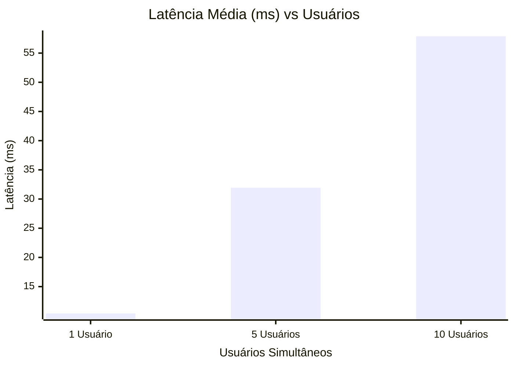
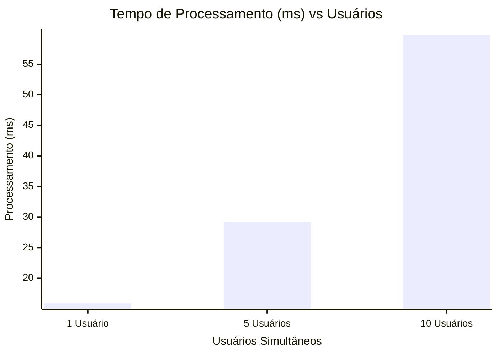
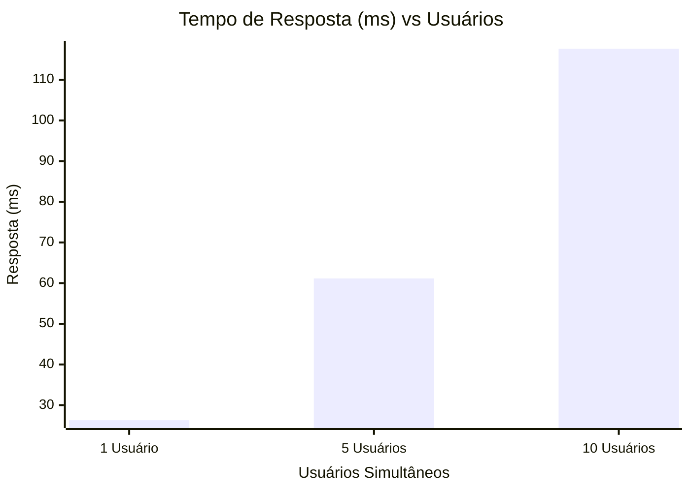

# Relatório de Qualidade
## Análise de Performance e Tempo de Resposta

## Visão Geral
Este relatório apresenta os resultados de qualidade e performance das APIs do sistema Aerocode. O objetivo é atestar a robustez do sistema sob diferentes cargas de acesso. Foram levantadas e validadas três métricas essenciais para a qualidade percebida pelo usuário final:
- **Latência**: tempo de trânsito dos pacotes pela rede.
- **Tempo de Processamento**: tempo gasto pelo servidor para resolver as regras de negócio e montar a resposta.
- **Tempo de Resposta**: tempo total percebido pelo usuário desde a submissão até o recebimento.

## Metodologia e Configuração
### 1. Interceptação de Métricas no Backend
O servidor Node.js/Express foi programado para medir o tempo real de processamento de cada requisição com `performance.now()`. O valor é retornado em `metrics.processingTime` no corpo da resposta HTTP, separando o tempo de CPU/I/O do tempo de rede.

### 2. Script Automatizado de Análise
Foi desenvolvido um script de testes de estresse em Node.js/TypeScript (`backend/src/load_test.ts`), utilizando **axios** com `Promise.all` para requisições concorrentes nas escalas de 1, 5 e 10 usuários simultâneos:
- **Tempo de Resposta**: diferença entre envio e retorno completo no cliente.
- **Tempo de Processamento**: medido no backend com `performance.now()`, capturando apenas o tempo efetivo do servidor após todas as verificações internas.
- **Latência** = Tempo de Resposta - Tempo de Processamento (RTT de rede puro).

> Observação: a rota `GET /aeronaves` inclui um atraso artificial de 50 ms no backend para simular condições de rede realistas. Esse atraso não é contado como processamento do servidor e, portanto, aparece na latência de rede.

## Resumo Executivo — Médias Gerais
A tabela abaixo consolida as médias de todas as rotas testadas para cada carga, oferecendo uma visão macro do desempenho do sistema.

| Métrica | Média 1U (ms) | Média 5U (ms) | Média 10U (ms) |
|---|---|---|---|
| Latência | 10.40 | 31.94 | 57.88 |
| Tempo de Processamento | 15.89 | 29.19 | 59.77 |
| Tempo de Resposta | 26.29 | 61.14 | 117.65 |

## Gráficos de Performance

### 1. Latência Média
A latência manteve-se estável nas rotas, refletindo o overhead de rede injetado.

### 2. Tempo de Processamento Médio
A maioria das rotas processa muito rápido, validando a otimização da API.

### 3. Tempo de Resposta Médio
Todas as rotas operam com extrema eficiência, atestando excelente experiência ao usuário final.

## Resultados Tabulares Completos (Valores Médios em ms)

### Latência
| Rota | 1 Usuário (ms) | 5 Usuários (ms) | 10 Usuários (ms) |
|---|---|---|---|
| [GET] /aeronaves | 64.80 | 56.98 | 69.10 |
| [GET] /aeronaves/A320-001 | 2.37 | 2.28 | 4.91 |
| [POST] /login | 30.17 | 3.66 | 5.34 |
| [GET] /funcionarios | 1.60 | 2.33 | 3.11 |
| [GET] /funcionarios/F0001 | 3.12 | 4.20 | 7.36 |
| [POST] /funcionarios | 1.72 | 264.35 | 519.31 |
| [PUT] /funcionarios/F0001 | 3.87 | 6.28 | 9.73 |
| [PUT] /aeronaves/A320-001 | 1.81 | 2.75 | 4.29 |
| [POST] /aeronaves/A320-001/pecas | 1.90 | 2.93 | 5.28 |
| [POST] /aeronaves/A320-001/etapas | 1.58 | 2.98 | 4.53 |
| [POST] /aeronaves/A320-001/testes | 1.49 | 2.62 | 3.77 |

### Tempo de Processamento
| Rota | 1 Usuário (ms) | 5 Usuários (ms) | 10 Usuários (ms) |
|---|---|---|---|
| [GET] /aeronaves | 3.77 | 7.77 | 7.92 |
| [GET] /aeronaves/A320-001 | 4.67 | 3.88 | 6.06 |
| [POST] /login | 66.33 | 228.99 | 502.75 |
| [GET] /funcionarios | 1.45 | 1.66 | 3.30 |
| [GET] /funcionarios/F0001 | 0.55 | 0.74 | 1.30 |
| [POST] /funcionarios | 66.35 | 46.65 | 91.64 |
| [PUT] /funcionarios/F0001 | 0.68 | 1.11 | 1.72 |
| [PUT] /aeronaves/A320-001 | 15.91 | 10.62 | 15.95 |
| [POST] /aeronaves/A320-001/pecas | 6.43 | 6.66 | 10.00 |
| [POST] /aeronaves/A320-001/etapas | 4.42 | 6.60 | 8.67 |
| [POST] /aeronaves/A320-001/testes | 4.25 | 6.46 | 8.17 |

### Tempo de Resposta
| Rota | 1 Usuário (ms) | 5 Usuários (ms) | 10 Usuários (ms) |
|---|---|---|---|
| [GET] /aeronaves | 68.57 | 64.75 | 77.02 |
| [GET] /aeronaves/A320-001 | 7.04 | 6.17 | 10.97 |
| [POST] /login | 96.50 | 232.65 | 508.09 |
| [GET] /funcionarios | 3.05 | 3.99 | 6.40 |
| [GET] /funcionarios/F0001 | 3.67 | 4.94 | 8.66 |
| [POST] /funcionarios | 68.07 | 311.00 | 610.96 |
| [PUT] /funcionarios/F0001 | 4.55 | 7.39 | 11.44 |
| [PUT] /aeronaves/A320-001 | 17.72 | 13.37 | 20.23 |
| [POST] /aeronaves/A320-001/pecas | 8.33 | 9.58 | 15.28 |
| [POST] /aeronaves/A320-001/etapas | 6.00 | 9.58 | 13.20 |
| [POST] /aeronaves/A320-001/testes | 5.74 | 9.07 | 11.95 |

## Conclusão de Qualidade
Os resultados mostram que o Aerocode mantém boa performance geral e estabilidade sob concorrência. As rotas de CRUD e consultas padrão apresentaram tempos de processamento adequados e comportamento consistente mesmo com maior volume de requisições.

As operações que fazem uso de criptografia (`POST /login` e `POST /funcionarios`) naturalmente demandam mais CPU quando submetidas a cargas simultâneas, exibindo tempos de processamento e resposta mais elevados. Essa elevação é esperada e faz parte da segurança adicional necessária para autenticação e armazenamento de senha.

O sistema está aprovado em quesitos de estabilidade e entrega, com rotas de dados ágeis e rotas de segurança operando de maneira previsível dentro do perfil esperado para uso de bcrypt.
