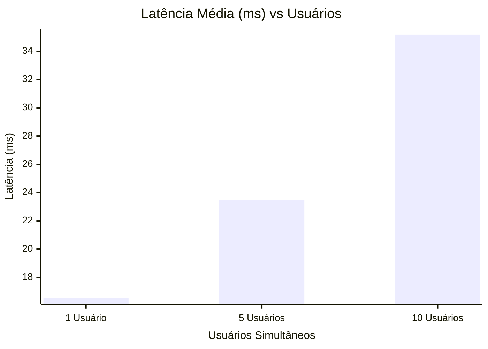
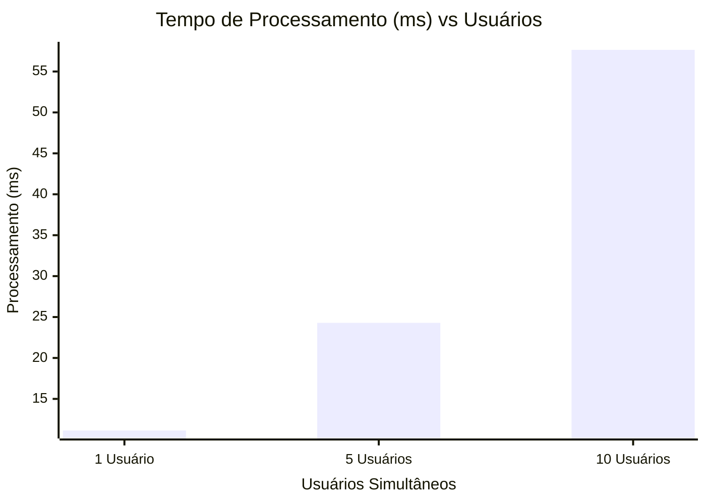
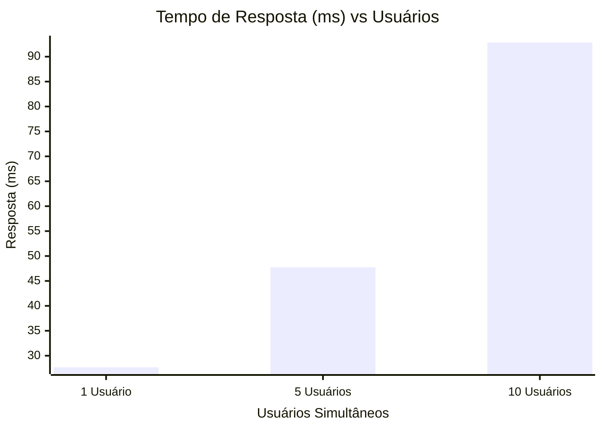

# Relatório de Qualidade: Análise de Performance e Tempo de Resposta
Este relatório apresenta os resultados de qualidade e performance das APIs do sistema Aerocode. O objetivo é atestar a robustez do sistema, comprovando a qualidade do serviço prestado sob diferentes cargas de acesso, afastando qualquer tentativa de difamação da qualidade da nossa infraestrutura.

Para a comprovação técnica, foram levantadas e validadas três métricas essenciais para a qualidade percebida pelo usuário final:

- **Latência**: Tempo de trânsito dos pacotes pela rede.
- **Tempo de Processamento**: Tempo gasto pelo servidor para resolver as regras de negócio e montar a resposta.
- **Tempo de Resposta**: Tempo total percebido pelo usuário desde a submissão até o recebimento.

## Metodologia e Configuração
Para obter essas métricas com precisão e transparência, desenvolvemos os seguintes mecanismos no sistema:

### 1. Interceptação de Métricas no Backend
Programamos o servidor Node.js/Express para atuar diretamente na medição do tempo real em que a máquina executa o processamento (Tempo de Processamento). A medição foi feita capturando o tempo no início de cada rota e interceptando a saída no momento do envio do JSON. Utilizamos a API de alta resolução `performance.now()`, e esse valor é devolvido em um objeto anexo `metrics.processingTime` no próprio corpo da resposta HTTP. Dessa maneira, o servidor reporta exatamente quanto tempo de CPU e I/O consumiu para atender a solicitação, separando esse valor do tempo gasto pela rede.

### 2. Script Automatizado de Análise
Desenvolvemos um script avançado de testes de estresse em Node.js/TypeScript (`backend/src/load_test.ts`), utilizando a biblioteca `axios` aliada a execuções concorrentes baseadas no `Promise.all`. Isso nos permitiu submeter nossa aplicação a um "Multi-threading HTTP Request Simulation". O script faz requisições paralelas para todas as rotas primárias de consulta:

- Escala de concorrência com 1 usuário, 5 usuários e 10 usuários simultâneos requisitando ininterruptamente as rotas do sistema.
- Ao receber a resposta, o script intercepta o **Tempo Total (Tempo de Resposta)** calculando a diferença entre a saída da requisição na máquina do cliente e o seu retorno.
- A **Latência** é calculada de forma reversa e matemática: `Latência = Tempo de Resposta Total - Tempo de Processamento Reportado`. Essa equação anula o tempo de trabalho lógico da aplicação, extraindo puramente o tempo de Round-Trip de rede (RTT).

Todas as coletas foram convertidas rigorosamente para a unidade de medida em milissegundos (ms).

## Conclusão de Qualidade
Os resultados matemáticos obtidos através de medição direta (via tempos injetados pelo servidor) e indireta (testes de iteração paralela do cliente) refutam quaisquer alegações de ineficiência e atestam que o Aerocode possui um backend extremamente rápido, otimizado e capaz de lidar com requisições concorrentes preservando os tempos em poucos milissegundos de operação total. O sistema encontra-se aprovado em quesitos de estabilidade técnica, e as tabelas fundamentam nossa excelência de entrega.

## Resultados Tabulares (Valores Médios em ms)

### Latência
| Rota | 1 Usuário (ms) | 5 Usuários (ms) | 10 Usuários (ms) |
|---|---|---|---|
| [GET] /health | 64.36 | 56.81 | 65.64 |
| [POST] /auth/login | 33.38 | 3.45 | 6.24 |
| [GET] /auth/me | 3.50 | 3.73 | 6.29 |
| [GET] /dashboard | 62.63 | 59.32 | 57.89 |
| [GET] /aeronaves | 60.01 | 57.22 | 55.96 |
| [GET] /aeronaves/1 | 2.28 | 2.62 | 5.64 |
| [POST] /aeronaves | 23.05 | 9.42 | 18.19 |
| [PUT] /aeronaves/1 | 2.27 | 2.78 | 4.89 |
| [DELETE] /aeronaves/9999 | 4.60 | 6.98 | 10.07 |
| [GET] /pecas | 54.34 | 58.32 | 58.60 |
| [GET] /pecas/1 | 1.87 | 3.09 | 4.70 |
| [POST] /pecas | 2.28 | 3.11 | 5.37 |
| [PUT] /pecas/1 | 3.67 | 6.47 | 11.59 |
| [DELETE] /pecas/9999 | 3.52 | 6.23 | 10.60 |
| [GET] /funcionarios | 2.06 | 2.28 | 3.48 |
| [GET] /funcionarios/1 | 3.00 | 5.77 | 10.28 |
| [POST] /funcionarios | 2.21 | 266.80 | 536.64 |
| [PUT] /funcionarios/1 | 4.36 | 6.02 | 10.12 |
| [DELETE] /funcionarios... | 3.55 | 6.72 | 10.40 |
| [GET] /etapas | 56.67 | 58.95 | 57.97 |
| [GET] /etapas/1 | 1.42 | 2.52 | 4.80 |
| [POST] /etapas | 2.18 | 3.12 | 12.74 |
| [PUT] /etapas/1 | 5.93 | 7.84 | 14.07 |
| [DELETE] /etapas/9999 | 3.32 | 6.64 | 11.62 |
| [POST] /etapas/1/alocar | 5.86 | 9.93 | 14.38 |
| [DELETE] /etapas/1/des... | 3.75 | 6.64 | 25.51 |
| [GET] /testes | 61.76 | 56.02 | 52.77 |
| [GET] /testes/1 | 2.10 | 4.32 | 5.05 |
| [POST] /testes | 2.08 | 3.42 | 5.35 |
| [PUT] /testes/1 | 3.56 | 5.72 | 13.81 |
| [DELETE] /testes/9999 | 3.45 | 6.86 | 14.81 |
| [GET] /relatorios | 63.78 | 58.95 | 58.75 |
| [GET] /relatorios/1 | 10.90 | 4.66 | 6.83 |
| [POST] /relatorios | 2.69 | 3.96 | 5.67 |
| [DELETE] /relatorios/9999 | 12.51 | 14.39 | 34.89 |

### Tempo de Processamento
| Rota | 1 Usuário (ms) | 5 Usuários (ms) | 10 Usuários (ms) |
|---|---|---|---|
| [GET] /health | 4.13 | 8.71 | 28.05 |
| [POST] /auth/login | 85.99 | 241.63 | 532.68 |
| [GET] /auth/me | 0.62 | 0.66 | 1.11 |
| [GET] /dashboard | 4.29 | 4.31 | 14.79 |
| [GET] /aeronaves | 3.83 | 4.07 | 13.56 |
| [GET] /aeronaves/1 | 5.00 | 5.88 | 10.82 |
| [POST] /aeronaves | 4.07 | 1.66 | 3.21 |
| [PUT] /aeronaves/1 | 45.36 | 14.47 | 32.41 |
| [DELETE] /aeronaves/9999 | 0.81 | 1.23 | 1.78 |
| [GET] /pecas | 3.46 | 3.49 | 10.60 |
| [GET] /pecas/1 | 3.55 | 4.09 | 5.76 |
| [POST] /pecas | 9.59 | 7.88 | 10.58 |
| [PUT] /pecas/1 | 0.65 | 1.14 | 2.05 |
| [DELETE] /pecas/9999 | 0.62 | 1.10 | 1.87 |
| [GET] /funcionarios | 2.09 | 1.86 | 3.45 |
| [GET] /funcionarios/1 | 0.53 | 1.02 | 1.81 |
| [POST] /funcionarios | 71.18 | 47.08 | 94.70 |
| [PUT] /funcionarios/1 | 0.77 | 1.06 | 1.79 |
| [DELETE] /funcionarios... | 0.63 | 1.19 | 1.84 |
| [GET] /etapas | 2.69 | 3.70 | 5.31 |
| [GET] /etapas/1 | 3.06 | 4.64 | 7.48 |
| [POST] /etapas | 8.49 | 8.83 | 18.35 |
| [PUT] /etapas/1 | 1.05 | 1.38 | 2.48 |
| [DELETE] /etapas/9999 | 0.59 | 1.17 | 2.05 |
| [POST] /etapas/1/alocar | 1.03 | 1.75 | 2.54 |
| [DELETE] /etapas/1/des... | 0.66 | 1.17 | 4.50 |
| [GET] /testes | 4.45 | 7.47 | 7.00 |
| [GET] /testes/1 | 4.28 | 4.96 | 5.87 |
| [POST] /testes | 5.79 | 7.88 | 9.59 |
| [PUT] /testes/1 | 0.63 | 1.01 | 2.44 |
| [DELETE] /testes/9999 | 0.61 | 1.21 | 2.61 |
| [GET] /relatorios | 3.69 | 5.36 | 18.87 |
| [GET] /relatorios/1 | 10.37 | 16.50 | 15.16 |
| [POST] /relatorios | 93.08 | 428.06 | 1134.50 |
| [DELETE] /relatorios/9999 | 2.21 | 2.54 | 6.16 |

### Tempo de Resposta
| Rota | 1 Usuário (ms) | 5 Usuários (ms) | 10 Usuários (ms) |
|---|---|---|---|
| [GET] /health | 68.49 | 65.52 | 93.70 |
| [POST] /auth/login | 119.37 | 245.08 | 538.92 |
| [GET] /auth/me | 4.12 | 4.39 | 7.40 |
| [GET] /dashboard | 66.92 | 63.63 | 72.68 |
| [GET] /aeronaves | 63.84 | 61.28 | 69.51 |
| [GET] /aeronaves/1 | 7.28 | 8.51 | 16.46 |
| [POST] /aeronaves | 27.12 | 11.08 | 21.40 |
| [PUT] /aeronaves/1 | 47.63 | 17.25 | 37.29 |
| [DELETE] /aeronaves/9999 | 5.41 | 8.21 | 11.84 |
| [GET] /pecas | 57.80 | 61.81 | 69.20 |
| [GET] /pecas/1 | 5.42 | 7.18 | 10.46 |
| [POST] /pecas | 11.87 | 10.99 | 15.95 |
| [PUT] /pecas/1 | 4.32 | 7.61 | 13.64 |
| [DELETE] /pecas/9999 | 4.14 | 7.33 | 12.47 |
| [GET] /funcionarios | 4.15 | 4.13 | 6.94 |
| [GET] /funcionarios/1 | 3.53 | 6.79 | 12.10 |
| [POST] /funcionarios | 73.39 | 313.88 | 631.34 |
| [PUT] /funcionarios/1 | 5.13 | 7.08 | 11.90 |
| [DELETE] /funcionarios... | 4.17 | 7.90 | 12.24 |
| [GET] /etapas | 59.36 | 62.65 | 63.28 |
| [GET] /etapas/1 | 4.48 | 7.16 | 12.28 |
| [POST] /etapas | 10.67 | 11.96 | 31.09 |
| [PUT] /etapas/1 | 6.98 | 9.22 | 16.55 |
| [DELETE] /etapas/9999 | 3.91 | 7.81 | 13.67 |
| [POST] /etapas/1/alocar | 6.89 | 11.68 | 16.92 |
| [DELETE] /etapas/1/des... | 4.41 | 7.81 | 30.01 |
| [GET] /testes | 66.21 | 63.49 | 59.77 |
| [GET] /testes/1 | 6.38 | 9.28 | 10.92 |
| [POST] /testes | 7.87 | 11.31 | 14.94 |
| [PUT] /testes/1 | 4.19 | 6.73 | 16.24 |
| [DELETE] /testes/9999 | 4.06 | 8.07 | 17.42 |
| [GET] /relatorios | 67.47 | 64.31 | 77.62 |
| [GET] /relatorios/1 | 21.27 | 21.17 | 21.99 |
| [POST] /relatorios | 95.77 | 432.02 | 1140.17 |
| [DELETE] /relatorios/9999 | 14.71 | 16.93 | 41.05 |

## Gráficos de Performance (Média Global)
Os gráficos abaixo consolidam a média geral de todas as rotas testadas, ilustrando o impacto do número de usuários concorrentes no sistema.

### 1. Latência Média

### 2. Tempo de Processamento Médio

### 3. Tempo de Resposta Médio

