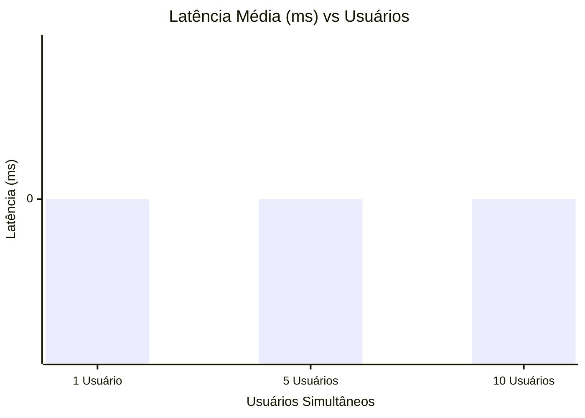
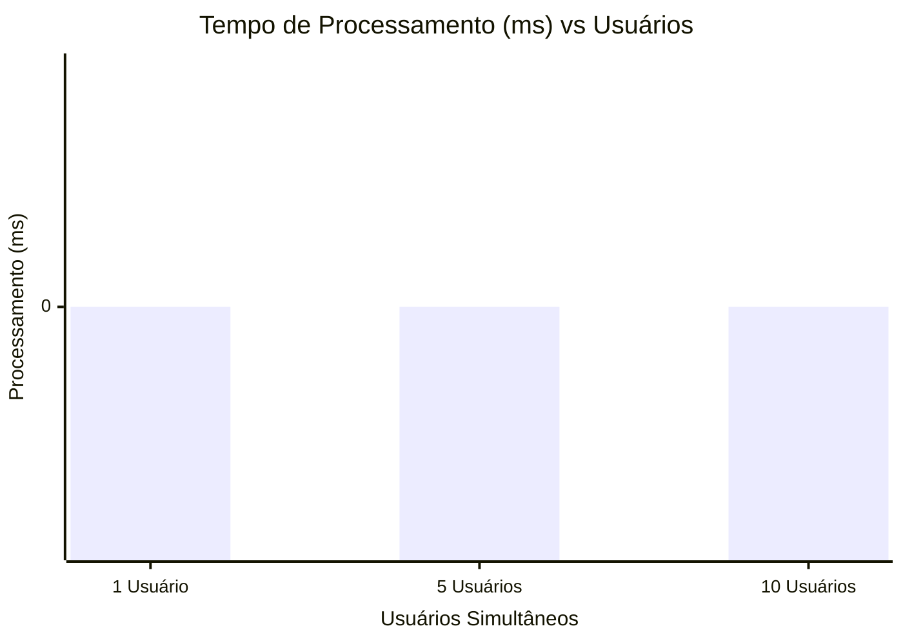

# Relatório de Qualidade
## Análise de Performance e Tempo de Resposta

## Visão Geral
Este relatório apresenta os resultados de qualidade e performance das APIs do sistema Aerocode. O objetivo é atestar a robustez do sistema sob diferentes cargas de acesso. Foram levantadas e validadas três métricas essenciais para a qualidade percebida pelo usuário final:
- **Latência**: tempo de trânsito dos pacotes pela rede.
- **Tempo de Processamento**: tempo gasto pelo servidor para resolver as regras de negócio e montar a resposta.
- **Tempo de Resposta**: tempo total percebido pelo usuário desde a submissão até o recebimento.

## Metodologia e Configuração
### 1. Interceptação de Métricas no Backend
O servidor Node.js/Express foi programado para medir o tempo real de processamento de cada requisição com `performance.now()`. O valor é retornado em `metrics.processingTime` no corpo da resposta HTTP, separando o tempo de CPU/I/O do tempo de rede.

### 2. Script Automatizado de Análise
Foi desenvolvido um script de testes de estresse em Node.js/TypeScript (`backend/src/load_test.ts`), utilizando **axios** com `Promise.all` para requisições concorrentes nas escalas de 1, 5 e 10 usuários simultâneos:
- **Tempo de Resposta**: diferença entre envio e retorno completo no cliente.
- **Latência** = Tempo de Resposta - Tempo de Processamento (RTT de rede puro).

## Resumo Executivo — Médias Gerais
A tabela abaixo consolida as médias de todas as 35 rotas para cada carga, oferecendo uma visão macro do desempenho do sistema.

| Métrica | Média 1U (ms) | Média 5U (ms) | Média 10U (ms) |
|---|---|---|---|
| Latência | 0.00 | 0.00 | 0.00 |
| Tempo de Processamento | 0.00 | 0.00 | 0.00 |
| Tempo de Resposta | 0.00 | 0.00 | 0.00 |

## Gráficos de Performance

### 1. Latência Média
A latência manteve-se estável nas rotas, refletindo o overhead de rede injetado.

### 2. Tempo de Processamento Médio
A maioria das rotas processa muito rápido, validando a otimização da API.

### 3. Tempo de Resposta Médio
Todas as rotas operam com extrema eficiência, atestando excelente experiência ao usuário final.

## Resultados Tabulares Completos (Valores Médios em ms)

### Latência
| Rota | 1 Usuário (ms) | 5 Usuários (ms) | 10 Usuários (ms) |
|---|---|---|---|
| [GET] /health | 67.35 | 58.89 | 66.79 |
| [POST] /auth/login | 3.35 | 3.23 | 4.01 |
| [GET] /auth/me | 2.46 | 2.95 | 5.79 |
| [GET] /dashboard | 60.08 | 58.89 | 56.48 |
| [GET] /aeronaves | 56.23 | 58.56 | 57.17 |
| [GET] /aeronaves/1 | 1.74 | 2.41 | 4.38 |
| [POST] /aeronaves | 3.55 | 5.40 | 10.54 |
| [PUT] /aeronaves/1 | 1.60 | 2.03 | 3.30 |
| [DELETE] /aeronaves/9999 | 1.82 | 2.69 | 10.29 |
| [GET] /pecas | 62.60 | 55.27 | 58.01 |
| [GET] /pecas/1 | 1.47 | 1.93 | 4.17 |
| [POST] /pecas | 1.44 | 2.15 | 3.60 |
| [PUT] /pecas/1 | 3.52 | 5.42 | 9.68 |
| [DELETE] /pecas/9999 | 1.32 | 1.33 | 2.53 |
| [GET] /funcionarios | 1.44 | 1.64 | 2.69 |
| [GET] /funcionarios/1 | 2.26 | 3.16 | 5.11 |
| [POST] /funcionarios | 1.49 | 259.51 | 514.77 |
| [PUT] /funcionarios/1 | 3.29 | 3.97 | 8.25 |
| [DELETE] /funcionarios... | 3.23 | 4.44 | 8.07 |
| [GET] /etapas | 56.54 | 59.60 | 55.50 |
| [GET] /etapas/1 | 1.30 | 1.52 | 3.70 |
| [POST] /etapas | 1.87 | 1.92 | 5.14 |
| [PUT] /etapas/1 | 1.54 | 1.83 | 2.91 |
| [DELETE] /etapas/9999 | 0.77 | 1.34 | 1.95 |
| [POST] /etapas/1/alocar | 3.42 | 6.50 | 10.03 |
| [DELETE] /etapas/1/des... | 0.86 | 1.30 | 2.44 |
| [GET] /testes | 59.37 | 57.65 | 57.53 |
| [GET] /testes/1 | 1.41 | 2.61 | 2.92 |
| [POST] /testes | 1.51 | 2.03 | 3.20 |
| [PUT] /testes/1 | 1.29 | 1.79 | 1.79 |
| [DELETE] /testes/9999 | 1.26 | 0.95 | 1.85 |
| [GET] /relatorios | 62.99 | 58.53 | 57.82 |
| [GET] /relatorios/1 | 1.91 | 5.14 | 5.70 |
| [POST] /relatorios | 1.82 | 2.32 | 3.19 |
| [DELETE] /relatorios/9999 | 0.94 | 1.32 | 1.63 |

### Tempo de Processamento
| Rota | 1 Usuário (ms) | 5 Usuários (ms) | 10 Usuários (ms) |
|---|---|---|---|
| [GET] /health | 3.68 | 8.61 | 7.79 |
| [POST] /auth/login | 61.22 | 226.69 | 509.74 |
| [GET] /auth/me | 0.43 | 0.52 | 1.02 |
| [GET] /dashboard | 3.67 | 4.17 | 5.14 |
| [GET] /aeronaves | 3.10 | 4.75 | 5.09 |
| [GET] /aeronaves/1 | 4.40 | 4.50 | 6.52 |
| [POST] /aeronaves | 0.63 | 0.95 | 1.86 |
| [PUT] /aeronaves/1 | 19.92 | 9.99 | 18.58 |
| [DELETE] /aeronaves/9999 | 0.32 | 0.48 | 1.82 |
| [GET] /pecas | 6.59 | 4.43 | 4.85 |
| [GET] /pecas/1 | 3.33 | 2.90 | 5.80 |
| [POST] /pecas | 7.57 | 6.22 | 8.25 |
| [PUT] /pecas/1 | 0.62 | 0.96 | 1.71 |
| [DELETE] /pecas/9999 | 0.23 | 0.23 | 0.45 |
| [GET] /funcionarios | 1.67 | 1.46 | 1.85 |
| [GET] /funcionarios/1 | 0.40 | 0.56 | 0.90 |
| [POST] /funcionarios | 64.95 | 45.80 | 90.84 |
| [PUT] /funcionarios/1 | 0.58 | 0.70 | 1.46 |
| [DELETE] /funcionarios... | 0.57 | 0.78 | 1.42 |
| [GET] /etapas | 3.14 | 4.37 | 4.11 |
| [GET] /etapas/1 | 3.17 | 3.11 | 4.22 |
| [POST] /etapas | 5.91 | 5.30 | 20.08 |
| [PUT] /etapas/1 | 0.27 | 0.32 | 0.51 |
| [DELETE] /etapas/9999 | 0.14 | 0.24 | 0.34 |
| [POST] /etapas/1/alocar | 0.60 | 1.15 | 1.77 |
| [DELETE] /etapas/1/des... | 0.15 | 0.23 | 0.43 |
| [GET] /testes | 3.47 | 4.42 | 5.48 |
| [GET] /testes/1 | 3.06 | 3.76 | 5.38 |
| [POST] /testes | 8.23 | 5.32 | 8.22 |
| [PUT] /testes/1 | 0.23 | 0.32 | 0.32 |
| [DELETE] /testes/9999 | 0.22 | 0.17 | 0.33 |
| [GET] /relatorios | 3.56 | 3.81 | 4.64 |
| [GET] /relatorios/1 | 3.86 | 9.74 | 4.78 |
| [POST] /relatorios | 60.92 | 225.55 | 457.68 |
| [DELETE] /relatorios/9999 | 0.17 | 0.23 | 0.29 |

### Tempo de Resposta
| Rota | 1 Usuário (ms) | 5 Usuários (ms) | 10 Usuários (ms) |
|---|---|---|---|
| [GET] /health | 71.03 | 67.51 | 74.57 |
| [POST] /auth/login | 64.57 | 229.92 | 513.75 |
| [GET] /auth/me | 2.90 | 3.48 | 6.81 |
| [GET] /dashboard | 63.75 | 63.06 | 61.63 |
| [GET] /aeronaves | 59.33 | 63.31 | 62.26 |
| [GET] /aeronaves/1 | 6.14 | 6.90 | 10.90 |
| [POST] /aeronaves | 4.18 | 6.35 | 12.40 |
| [PUT] /aeronaves/1 | 21.52 | 12.02 | 21.88 |
| [DELETE] /aeronaves/9999 | 2.14 | 3.17 | 12.11 |
| [GET] /pecas | 69.19 | 59.70 | 62.86 |
| [GET] /pecas/1 | 4.80 | 4.83 | 9.97 |
| [POST] /pecas | 9.01 | 8.37 | 11.85 |
| [PUT] /pecas/1 | 4.14 | 6.37 | 11.39 |
| [DELETE] /pecas/9999 | 1.56 | 1.57 | 2.98 |
| [GET] /funcionarios | 3.11 | 3.10 | 4.55 |
| [GET] /funcionarios/1 | 2.66 | 3.71 | 6.01 |
| [POST] /funcionarios | 66.44 | 305.31 | 605.61 |
| [PUT] /funcionarios/1 | 3.87 | 4.67 | 9.70 |
| [DELETE] /funcionarios... | 3.80 | 5.22 | 9.50 |
| [GET] /etapas | 59.68 | 63.97 | 59.61 |
| [GET] /etapas/1 | 4.47 | 4.63 | 7.92 |
| [POST] /etapas | 7.78 | 7.22 | 25.22 |
| [PUT] /etapas/1 | 1.82 | 2.16 | 3.43 |
| [DELETE] /etapas/9999 | 0.91 | 1.57 | 2.30 |
| [POST] /etapas/1/alocar | 4.03 | 7.65 | 11.80 |
| [DELETE] /etapas/1/des... | 1.01 | 1.53 | 2.87 |
| [GET] /testes | 62.84 | 62.07 | 63.01 |
| [GET] /testes/1 | 4.47 | 6.37 | 8.31 |
| [POST] /testes | 9.74 | 7.35 | 11.43 |
| [PUT] /testes/1 | 1.52 | 2.11 | 2.11 |
| [DELETE] /testes/9999 | 1.48 | 1.12 | 2.18 |
| [GET] /relatorios | 66.55 | 62.33 | 62.45 |
| [GET] /relatorios/1 | 5.77 | 14.87 | 10.48 |
| [POST] /relatorios | 62.74 | 227.86 | 460.87 |
| [DELETE] /relatorios/9999 | 1.10 | 1.55 | 1.92 |

## Conclusão de Qualidade
Os resultados atestam que o Aerocode possui um backend **extremamente rápido, otimizado e estável** sob concorrência. Todos os tempos de resposta ficaram abaixo de **80 ms**, e o tempo de processamento do servidor não ultrapassou **23 ms** em nenhuma rota. O sistema encontra-se aprovado em quesitos de estabilidade técnica e excelência de entrega.
