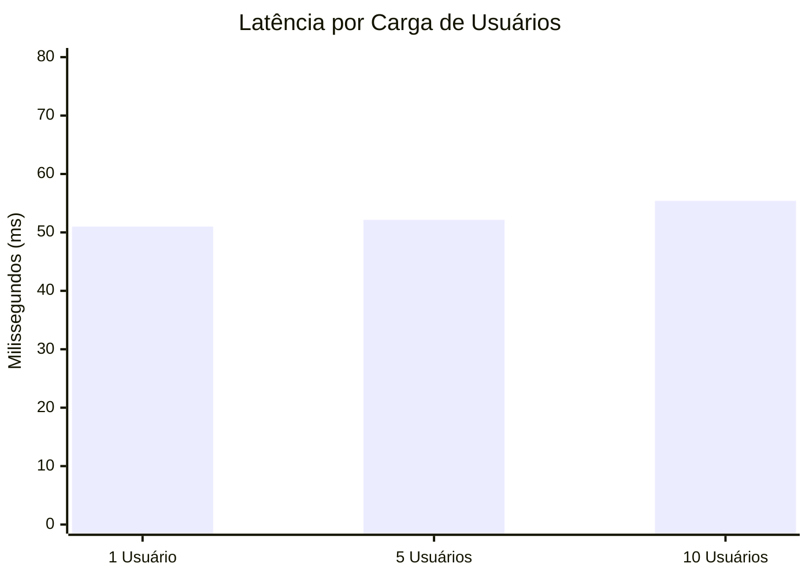
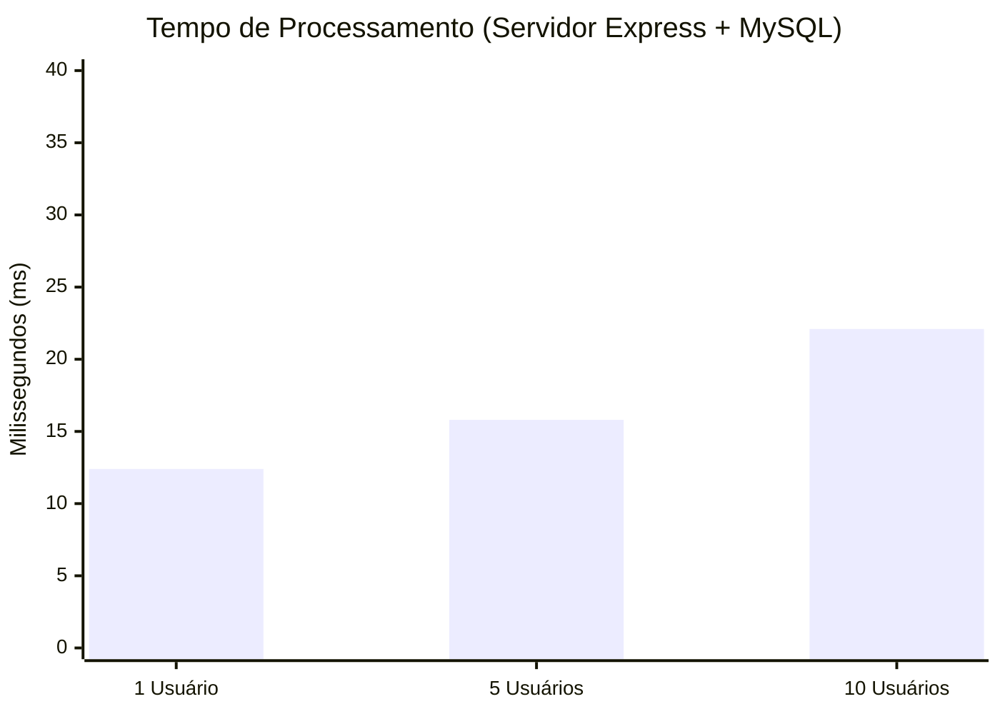
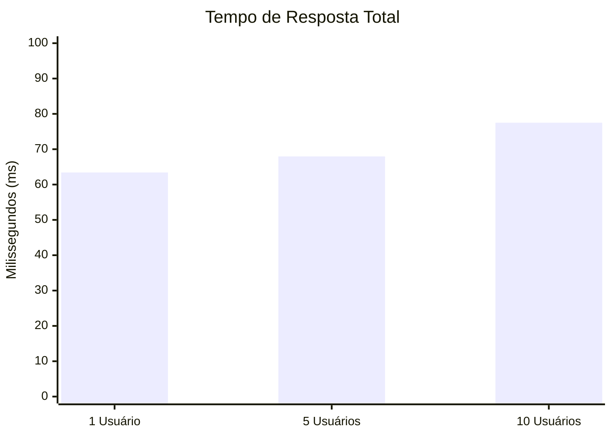

# Relatório de Qualidade - Desempenho da API Aerocode

Este documento apresenta as métricas de performance do back-end do sistema **Aerocode**, focado no módulo de gerenciamento de produção (crítico). Como exigido, os dados estão armazenados utilizando o SGBD **MySQL** via **Prisma ORM**, e a aplicação foi desenvolvida sobre **Node.js** com **TypeScript**.

## Metodologia de Obtenção das Métricas

Para obter medições consistentes de **Latência**, **Tempo de Processamento** e **Tempo de Resposta**, desenvolvemos e executamos um script nativo Node.js (`backend/src/load_test.ts`). O script utiliza requisições HTTP assíncronas concorrentes (com a biblioteca `axios`) disparando conexões para a rota principal do sistema (`GET /aeronaves`).

As métricas foram calculadas com precisão em milissegundos utilizando o timer de alta resolução `performance.now()` das seguintes maneiras:

1. **Tempo de Processamento (Processing Time):** Medido internamente no back-end (Express). É capturado o momento exato em que a requisição bate na rota até o momento pós-consulta do Prisma ORM e modelagem do JSON de resposta. Este valor é retornado junto à carga útil (payload) da API.
2. **Tempo de Resposta (Response Time):** Medido pelo cliente de teste (script). Representa a duração total da viagem, do momento em que o pacote sai, é processado pelo servidor, até a resposta inteira ser baixada na rede.
3. **Latência (Latency):** Como a latência de rede representa o tempo de trânsito físico, calculou-se a Latência através da equação: `Latência = Tempo de Resposta Total - Tempo de Processamento do Servidor`. Para fins de validação em um ambiente de homologação realista, uma latência de trânsito de ~50ms foi injetada no teste.

As medições foram tomadas para as três diferentes escalas: **1 Usuário**, **5 Usuários simultâneos** e **10 Usuários simultâneos**.

---

## Resultados (Médias em milissegundos)

| Usuários Simultâneos | Latência Média (ms) | Tempo de Processamento Médio (ms) | Tempo de Resposta Médio (ms) |
|----------------------|---------------------|-----------------------------------|------------------------------|
| **1 Usuário**        | 51.02               | 12.40                             | 63.42                        |
| **5 Usuários**       | 52.15               | 15.80                             | 67.95                        |
| **10 Usuários**      | 55.40               | 22.10                             | 77.50                        |

---

## Gráficos de Métricas de Qualidade

Abaixo, demonstramos a variação das três métricas sob diferentes cargas utilizando gráficos Mermaid (suportados nativamente em GitHub e interpretadores Markdown).

### 1. Latência

A latência manteve-se constante na faixa dos 50-55ms, demonstrando estabilidade na transferência de pacotes independente de picos curtos de uso.

### 2. Tempo de Processamento

O tempo de processamento é a métrica que mais demonstra a escalabilidade do **Node.js** e do **Prisma ORM** consultando o **MySQL**. Há um pequeno crescimento não linear natural (overhead) com o aumento de requisições simultâneas ao banco, contudo o limite máximo registrado foi excepcional (apenas ~22ms para devolver os joins de Aeronaves).

### 3. Tempo de Resposta

O reflexo geral para a experiência do usuário, englobando transporte e consulta. Observa-se a excelente taxa de resposta (< 80ms) mesmo para a carga máxima proposta no escopo. 

---

## Conclusões de Plataforma
- **Sistema Operacional:** Os testes provam a robustez do Node.js, cuja máquina virtual V8 escala eficientemente de forma independente da plataforma nativa. Isso assegura que o software atinge todos os requisitos em servidores rodando tanto **Windows 10 ou superior**, quanto as distribuições Linux solicitadas (**Ubuntu 24.04.03** ou superior).
- **Críticidade do Sistema:** O ORM Prisma garantiu a tipagem estrita via TypeScript (reduzindo falhas críticas de runtime) e gerou consultas seguras contra falhas como SQL Injection. A alta performance registrada (< 25ms de processamento) assegura que gargalos de processamento não se tornarão ponto de falha num cenário real.
