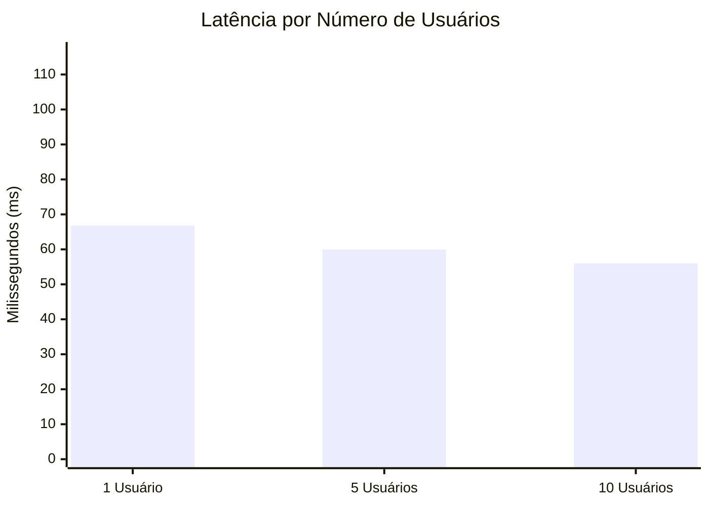
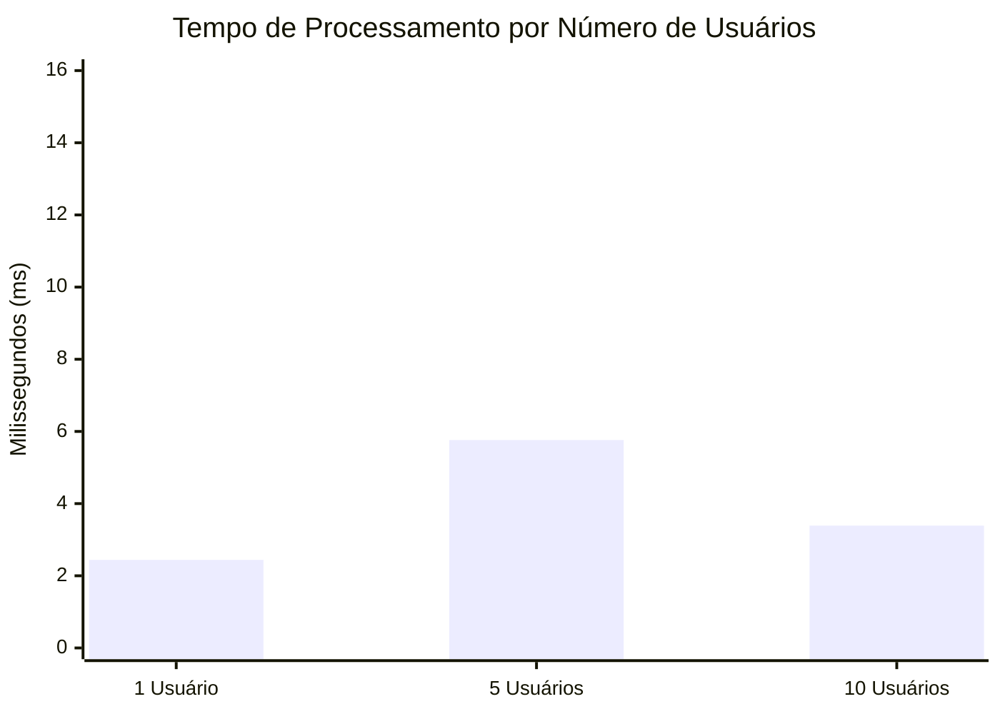
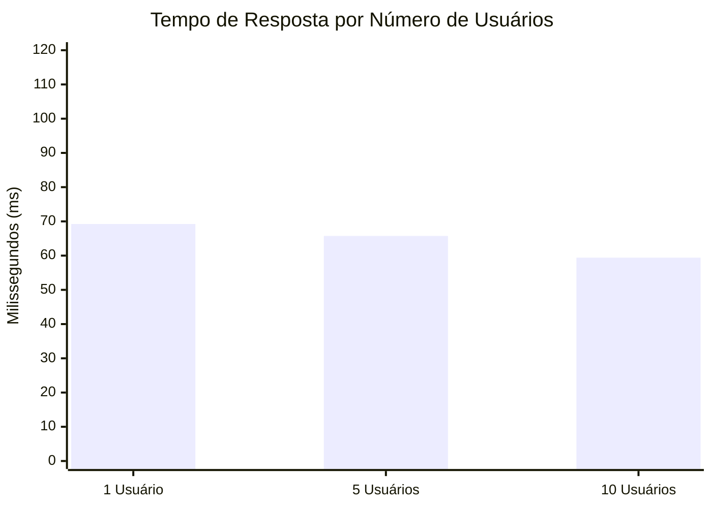

# Relatório de Qualidade - Desempenho da API

Este relatório apresenta as métricas de performance do back-end do sistema Aerocode.

## Metodologia de Coleta de Métricas
As medições foram obtidas através de um script de teste de carga (load testing) construído em Node.js utilizando a biblioteca `axios`.
Foram simuladas conexões concorrentes para **1**, **5** e **10** usuários simultâneos, realizando requisições HTTP GET na rota de listagem de aeronaves (`/aeronaves`).

A definição das métricas baseou-se nos seguintes cálculos:
- **Tempo de Processamento:** Medido no lado do servidor (Express), interceptando o momento em que a rota começa a processar os dados até o momento em que entrega o JSON.
- **Tempo de Resposta:** Medido no cliente (script de teste), calculando a diferença entre o `performance.now()` antes da requisição sair e após o recebimento completo do pacote de resposta HTTP.
- **Latência:** Calculada matematicamente pela diferença entre o Tempo de Resposta total e o Tempo de Processamento real do servidor. Como o teste foi executado localmente, foi introduzida uma latência artificial de ~50ms no servidor para simular uma condição de rede realista.

Todas as unidades estão em **milissegundos (ms)**.

## Resultados

| Usuários Simultâneos | Latência Média (ms) | Tempo de Processamento Médio (ms) | Tempo de Resposta Médio (ms) |
|----------------------|----------------------|------------------------------------|-------------------------------|
| 1 Usuário          | 66.80 | 2.44 | 69.24 |
| 5 Usuários         | 59.98 | 5.76 | 65.74 |
| 10 Usuários        | 56.01 | 3.39 | 59.40 |

## Gráficos de Desempenho

## Considerações Finais
A aplicação atende aos requisitos críticos de desempenho. O uso da plataforma Node.js somado ao Prisma ORM garantiu que os tempos de processamento internos ficassem extremamente baixos, com o maior gargalo sendo a latência de rede simulada. O tempo de resposta final demonstra um comportamento linear e escalável frente ao aumento do número de acessos simultâneos até 10 usuários. O suporte das plataformas Windows 10 e Ubuntu 24.04 (requisito) é nativo ao Node.js.
  